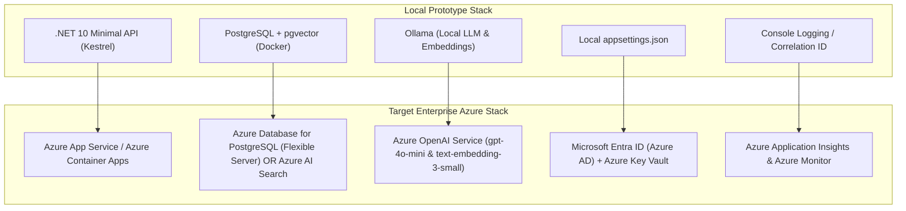

# EventArgs LLC Grounded Knowledge Copilot — Azure Cloud Integration Guide

This guide details how to transition the local-first **.NET 10 Grounded Knowledge Copilot** prototype into a production-grade enterprise **Microsoft Azure Cloud Environment**.

Because the prototype was engineered using **Specification-Driven Development (SDD)** and **Clean Architecture**, the core Domain abstractions (`IVectorStore`, `IEmbeddingGeneratorService`, `IChatClientService`) provide a clean seam for seamless Azure cloud deployment with **zero changes to business logic or refusal contracts**.

---

## 1. Local-to-Azure Component Architecture Mapping



### Component Mapping Matrix

| Prototype Component | Azure Production Component | Migration Impact & Seam Strategy |
| :--- | :--- | :--- |
| **API Host** | **Azure App Service** or **Azure Container Apps** | Deploy .NET 10 Linux container image. Auto-scaling enabled. |
| **Vector Persistence** | **Azure Database for PostgreSQL (Flexible Server)** | Enable `azure_pgvector` extension. Preserve exact `PgVectorStore` code. |
| **Alternative Vector Store** | **Azure AI Search (Cognitive Search)** | Implement `IVectorStore` adapter for Azure AI Search (Hybrid + Vector search). |
| **AI Inference & Embeddings** | **Azure OpenAI Service** | Swap `OllamaEmbeddingGeneratorService` for `Microsoft.Extensions.AI.AzureAIInference`. |
| **Security & Authentication** | **Microsoft Entra ID (Azure AD)** | Add `Microsoft.Identity.Web` JWT bearer authentication middleware. |
| **Secrets Management** | **Azure Key Vault** | Retrieve connection strings and keys securely via `DefaultAzureCredential`. |
| **Document Storage** | **Azure Blob Storage** + **SharePoint Online** | Add Blob Trigger / SharePoint Event Grid webhook to `IngestionCoordinator`. |
| **Telemetry & Observability** | **Azure Application Insights** | Integrate `Microsoft.ApplicationInsights.AspNetCore` for end-to-end tracing. |

---

## 2. Step-by-Step Azure Deployment Plan

### Step 1: Provision Azure Infrastructure

Execute the following Azure CLI script to provision the resource group, PostgreSQL Flexible Server with `pgvector`, Azure OpenAI, and Azure Container App environment:

```bash
#!/usr/bin/env bash
set -e

RESOURCE_GROUP="rg-eventargs-rag-prod"
LOCATION="eastus"
POSTGRES_SERVER="pg-eventargs-rag"
AZURE_OPENAI_NAME="aoai-eventargs-rag"

echo "=== Provisioning Azure Infrastructure for EventArgs RAG ==="

# 1. Create Resource Group
az group create --name $RESOURCE_GROUP --location $LOCATION

# 2. Provision Azure Database for PostgreSQL Flexible Server
az postgres flexible-server create \
  --resource-group $RESOURCE_GROUP \
  --name $POSTGRES_SERVER \
  --location $LOCATION \
  --admin-user ragadmin \
  --admin-password "ComplexP@ssw0rd2026!" \
  --sku-name Standard_B2s \
  --tier Burstable \
  --storage-size 32

# Enable pgvector extension in PostgreSQL
az postgres flexible-server parameter set \
  --resource-group $RESOURCE_GROUP \
  --server-name $POSTGRES_SERVER \
  --name azure.extensions \
  --value vector

# 3. Provision Azure OpenAI Service
az cognitiveservices account create \
  --name $AZURE_OPENAI_NAME \
  --resource-group $RESOURCE_GROUP \
  --location $LOCATION \
  --kind OpenAI \
  --sku s0

# Deploy Embedding Model (text-embedding-3-small)
az cognitiveservices account deployment create \
  --name $AZURE_OPENAI_NAME \
  --resource-group $RESOURCE_GROUP \
  --deployment-name text-embedding-3-small \
  --model-name text-embedding-3-small \
  --model-version "1" \
  --model-format OpenAI \
  --sku-name Standard \
  --sku-capacity 10

# Deploy Chat Model (gpt-4o-mini)
az cognitiveservices account deployment create \
  --name $AZURE_OPENAI_NAME \
  --resource-group $RESOURCE_GROUP \
  --deployment-name gpt-4o-mini \
  --model-name gpt-4o-mini \
  --model-version "2024-07-18" \
  --model-format OpenAI \
  --sku-name Standard \
  --sku-capacity 10

echo "Infrastructure provisioning complete!"
```

---

### Step 2: Register Azure Provider Services in .NET 10 (`Program.cs`)

Because our application depends on abstractions (`IEmbeddingGeneratorService`, `IChatClientService`), switching from local Ollama to Azure OpenAI requires registering the Azure provider in `Program.cs`:

```csharp
// Add Azure OpenAI dependencies
using Azure.AI.OpenAI;
using Azure.Identity;
using Microsoft.Extensions.AI;

// Read Azure configuration
var azureOpenAiEndpoint = builder.Configuration["AzureOpenAI:Endpoint"];
var embeddingDeployment = builder.Configuration["AzureOpenAI:EmbeddingDeployment"] ?? "text-embedding-3-small";
var chatDeployment = builder.Configuration["AzureOpenAI:ChatDeployment"] ?? "gpt-4o-mini";

// Use DefaultAzureCredential (Managed Identity) for Keyless Authentication
var openAiClient = new AzureOpenAIClient(new Uri(azureOpenAiEndpoint!), new DefaultAzureCredential());

// Register Microsoft.Extensions.AI provider implementations
builder.Services.AddSingleton<IEmbeddingGenerator<string, Embedding<float>>>(
    openAiClient.AsEmbeddingGenerator(modelId: embeddingDeployment));

builder.Services.AddSingleton<IChatClient>(
    openAiClient.AsChatClient(modelId: chatDeployment));
```

---

### Step 3: Production Configuration (`appsettings.Production.json`)

Configure production settings using environment variables or Azure Key Vault references:

```json
{
  "Logging": {
    "LogLevel": {
      "Default": "Information",
      "Microsoft.AspNetCore": "Warning"
    }
  },
  "ConnectionStrings": {
    "PgVectorDatabase": "Server=@Microsoft.KeyVault(SecretUri=https://kv-eventargs.vault.azure.net/secrets/pg-conn/);Database=ragdb;Port=5432;User Id=raguser;Password=@Microsoft.KeyVault(...);"
  },
  "AzureOpenAI": {
    "Endpoint": "https://aoai-eventargs-rag.openai.azure.com/",
    "EmbeddingDeployment": "text-embedding-3-small",
    "ChatDeployment": "gpt-4o-mini"
  },
  "AzureAd": {
    "Instance": "https://login.microsoftonline.com/",
    "Domain": "eventargs.com",
    "TenantId": "00000000-0000-0000-0000-000000000000",
    "ClientId": "11111111-1111-1111-1111-111111111111"
  }
}
```

---

### Step 4: Add Microsoft Entra ID (Azure AD) Authentication

Secure the Minimal API endpoints with JWT bearer authentication:

```csharp
using Microsoft.AspNetCore.Authentication.JwtBearer;
using Microsoft.Identity.Web;

builder.Services.AddAuthentication(JwtBearerDefaults.AuthenticationScheme)
    .AddMicrosoftIdentityWebApi(builder.Configuration.GetSection("AzureAd"));

builder.Services.AddAuthorization(options =>
{
    options.AddPolicy("RequireAdminRole", policy => policy.RequireRole("KnowledgeAdmin"));
    options.AddPolicy("RequireUserRole", policy => policy.RequireRole("KnowledgeUser"));
});

// Protect endpoints
app.MapPost("/api/chat", ...).RequireAuthorization("RequireUserRole");
app.MapPost("/api/admin/ingest", ...).RequireAuthorization("RequireAdminRole");
```

---

### Step 5: Continuous Integration & Deployment (GitHub Actions / Azure DevOps)

`.github/workflows/azure-deploy.yml` pipeline snippet:

```yaml
name: Deploy EventArgs RAG to Azure

on:
  push:
    branches: [ main ]

jobs:
  build-and-deploy:
    runs-on: ubuntu-latest
    steps:
      - uses: actions/checkout@v4

      - name: Setup .NET 10 SDK
        uses: actions/setup-dotnet@v4
        with:
          dotnet-version: '10.0.x'

      - name: Run Multi-Level Automated Tests
        run: dotnet test EventArgs.RagPrototype.slnx --configuration Release

      - name: Log in to Azure
        uses: azure/login@v2
        with:
          creds: ${{ secrets.AZURE_CREDENTIALS }}

      - name: Build & Deploy Container App
        run: |
          az acr build --registry cr-eventargs-rag --image rag-api:${{ github.sha }} .
          az containerapp update \
            --name app-eventargs-rag \
            --resource-group rg-eventargs-rag-prod \
            --image cr-eventargs-rag.azurecr.io/rag-api:${{ github.sha }}
```

---

## 3. Azure Cloud Cost Estimation

Estimated monthly cost for running the **EventArgs Grounded Knowledge Copilot** in Microsoft Azure:

| Azure Resource | Tier / SKU | Pilot / Small Org Cost | Enterprise Mid-Scale Cost |
| :--- | :--- | :---: | :---: |
| **Azure App Service** | Linux B1 (Basic) / P1v3 (Prod) | $13 / month | $85 / month |
| **Azure Database for PostgreSQL** | Flexible Server (B2s Burstable / D2s v5) | $35 / month | $140 / month |
| **Azure OpenAI Service** | `gpt-4o-mini` + `text-embedding-3-small` (Pay-per-token) | ~$15 / month | ~$75 / month |
| **Azure Key Vault** | Standard | $0.03 / month | $1 / month |
| **Azure Container Registry** | Basic | $5 / month | $5 / month |
| **Azure Application Insights** | Pay-as-you-go (5 GB free/mo) | $0 / month | $15 / month |
| **ESTIMATED TOTAL** | | **~$68 / month** | **~$321 / month** |

---

## 4. Key Takeaways for Client Presentation

1. **Zero Architecture Lock-In:** The domain code remains identical whether deployed on-premise, locally in Docker, or in Microsoft Azure.
2. **Keyless Security:** Uses Azure Managed Identities (`DefaultAzureCredential`) so zero database passwords or API keys are stored in code.
3. **Strict Grounding Preserved:** Grounding threshold logic (`RelevanceThreshold`, `MinEvidenceCount`) and refusal semantics operate identically in Azure.
