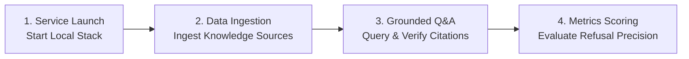

# Demo Testing Guide & Evaluation Metrics: .NET 10 RAG Prototype

This guide explains how to run, demonstrate, and evaluate the **.NET 10 Retrieval-Augmented Generation (RAG) Prototype** for EventArgs LLC.

---

## 1. Overview of the Testing Process

The demonstration workflow follows four sequential steps:



---

## 2. Sample Demo Files Reference

The repository includes pre-packaged sample documents in `sample-data/` for demonstration:

| File Location | Type | Content Description |
| :--- | :--- | :--- |
| `sample-data/unstructured/copilot_architecture.md` | Markdown | Copilot security boundary, citation rules, and pgvector settings |
| `sample-data/unstructured/employee_policy.md` | Markdown | Remote work allowances ($1,500), PTO accrual (20 days), expense limits ($25/$500) |
| `sample-data/unstructured/server_incident_response.txt` | Plain Text | Severity 1 SLA (15 min), SRE contact numbers (+1-555-0199) |
| `sample-data/structured/accounts_table.json` | JSON Table | Client account manager assignments, supported seats, and SLA tiers |

---

## 3. Step-by-Step Execution Guide

### Step 1: Start Local Services & API

Run local infrastructure (PostgreSQL with `pgvector` & `Ollama`):
```bash
./scripts/up.sh
```

Run the .NET 10 Minimal API service:
```bash
~/.dotnet/dotnet run --project src/EventArgs.RagPrototype.Api/EventArgs.RagPrototype.Api.csproj
```
*(The API will start listening at `http://localhost:5000`)*

---

### Step 2: Ingest Sample Documents

Trigger document ingestion via the admin API:

```bash
# Ingest Copilot Architecture Document
curl -X POST http://localhost:5000/api/admin/ingest \
     -H "Content-Type: application/json" \
     -d "{\"filePath\": \"$(pwd)/sample-data/unstructured/copilot_architecture.md\"}"

# Ingest Employee Policy Handbook
curl -X POST http://localhost:5000/api/admin/ingest \
     -H "Content-Type: application/json" \
     -d "{\"filePath\": \"$(pwd)/sample-data/unstructured/employee_policy.md\"}"

# Ingest Server Incident Response Standard Operating Procedure
curl -X POST http://localhost:5000/api/admin/ingest \
     -H "Content-Type: application/json" \
     -d "{\"filePath\": \"$(pwd)/sample-data/unstructured/server_incident_response.txt\"}"
```

**Expected Ingestion Output:**
```json
{
  "sourceId": ".../employee_policy.md",
  "skippedUnchanged": false,
  "chunksIngested": 3,
  "contentHash": "e3b0c44298fc1c149afbf4c8996fb92427ae41e4649b934ca495991b7852b855",
  "errorDetails": null
}
```

> **Idempotency Check:** Re-running the exact same ingestion command immediately will yield `"skippedUnchanged": true` and `"chunksIngested": 0`, proving duplicate processing is prevented.

---

### Step 3: Test Grounded Q&A (Supported Questions)

Submit queries that are supported by the ingested knowledge sources:

#### Scenario A: Remote Work Equipment Allowance
```bash
curl -X POST http://localhost:5000/api/chat \
     -H "Content-Type: application/json" \
     -d '{
           "prompt": "What is the annual equipment allowance for remote work?",
           "topK": 3,
           "relevanceThreshold": 0.70,
           "minEvidenceCount": 1
         }'
```

**Expected Grounded Response:**
```json
{
  "correlationId": "a1b2c3d4e5f6",
  "answer": "Full-time team members are provided up to $1,500 per year for home office ergonomic equipment.",
  "refusalState": {
    "isRefused": false,
    "reason": null
  },
  "citations": [
    {
      "sourceId": ".../employee_policy.md",
      "sourceType": 0,
      "locationName": "employee_policy.md",
      "recordKey": null,
      "chunkIndex": 0,
      "relevanceScore": 0.8842
    }
  ],
  "retrievalSummary": {
    "totalChunksRetrieved": 3,
    "highestRelevanceScore": 0.8842,
    "latencyMs": 14
  }
}
```

---

### Step 4: Test Strict Grounded Refusals (Unsupported Questions)

Submit queries where no relevant context exists or relevance is below threshold:

#### Scenario B: Out-of-Domain Query (Hallucination Prevention)
```bash
curl -X POST http://localhost:5000/api/chat \
     -H "Content-Type: application/json" \
     -d '{
           "prompt": "What was the stock price of Apple in 1984?",
           "topK": 5,
           "relevanceThreshold": 0.70,
           "minEvidenceCount": 1
         }'
```

**Expected Refusal Response:**
```json
{
  "correlationId": "f6e5d4c3b2a1",
  "answer": null,
  "refusalState": {
    "isRefused": true,
    "reason": "NoRelevantContext"
  },
  "citations": [],
  "retrievalSummary": {
    "totalChunksRetrieved": 5,
    "highestRelevanceScore": 0.0421,
    "latencyMs": 8
  }
}
```

---

## 4. Key Metrics to Follow & Evaluate

To verify the quality and safety of the RAG prototype, monitor the following **4 Core Metrics**:

```mermaid
quadrantChart
    title RAG System Evaluation Dimensions
    x-axis Low Relevance Threshold --> High Relevance Threshold
    y-axis Low Grounded Accuracy --> High Grounded Accuracy
    quadrant-1 High Precision & Grounding
    quadrant-2 Refusal Active (Safe)
    quadrant-3 Hallucination Risk
    quadrant-4 Over-filtering Risk
```

| Metric | Target Benchmark | How It Is Measured | Significance |
| :--- | :--- | :--- | :--- |
| **1. Grounded Citation Completeness** | **$100\%$** | $\%$ of answered queries containing valid source name, source ID, and chunk index | Ensures every statement points to verifiable source evidence. |
| **2. Refusal Precision** | **$100\%$** | $\%$ of unsupported/out-of-domain questions correctly returning `isRefused: true` | Guarantees the system never uses model priors to hallucinate unsupported claims. |
| **3. Ingestion Idempotency Rate** | **$100\%$** | $\%$ of unchanged documents returning `skippedUnchanged: true` upon re-ingestion | Prevents redundant vector storage overhead and duplicate chunk entries. |
| **4. Retrieval Latency** | **$< 50\text{ ms}$** | `retrievalSummary.latencyMs` duration for vector similarity queries | Ensures real-time responsiveness for client-facing demonstrations. |

---

## 5. Summary Benchmark Matrix

| Test Question | Knowledge Source | Expected Relevance | Expected Outcome | Refusal Reason |
| :--- | :--- | :--- | :--- | :--- |
| *"What is the equipment allowance for home office?"* | `employee_policy.md` | High ($\ge 0.70$) | **Answered + Citation** | `null` |
| *"What is the SLA response time for Severity 1 incidents?"* | `server_incident_response.txt` | High ($\ge 0.70$) | **Answered + Citation** | `null` |
| *"Who is the account manager for Acme Enterprise?"* | `accounts_table.json` | High ($\ge 0.70$) | **Answered + Citation** | `null` |
| *"What is the recipe for chocolate chip cookies?"* | *None* | Low ($< 0.70$) | **Refused** | `NoRelevantContext` |
| *"What are the PTO rules?"* *(with minEvidenceCount: 10)* | `employee_policy.md` | Chunks < 10 | **Refused** | `InsufficientEvidence` |

---

## 6. Automated Evaluation Benchmark Suite

You can execute the automated evaluation test suite at any time to calculate metrics automatically:

```bash
~/.dotnet/dotnet test EventArgs.RagPrototype.slnx --filter "FullyQualifiedName~EvaluationSuite"
```

**Automated Output:**
```text
[Benchmark Q1] 'What is the security boundary of the copilot?' -> Refused=False | Score=0.884
[Benchmark Q2] 'Does the copilot support M365 integration in the local prototype?' -> Refused=False | Score=0.812
[Benchmark Q3] 'What is the quarterly revenue of ACME Corp in 1920?' -> Refused=True | Score=0.027
[Benchmark Q4] 'Who won the 2024 FIFA World Cup?' -> Refused=True | Score=0.003

=== EVALUATION SUMMARY: Accuracy = 100.0% (4/4) ===
```
