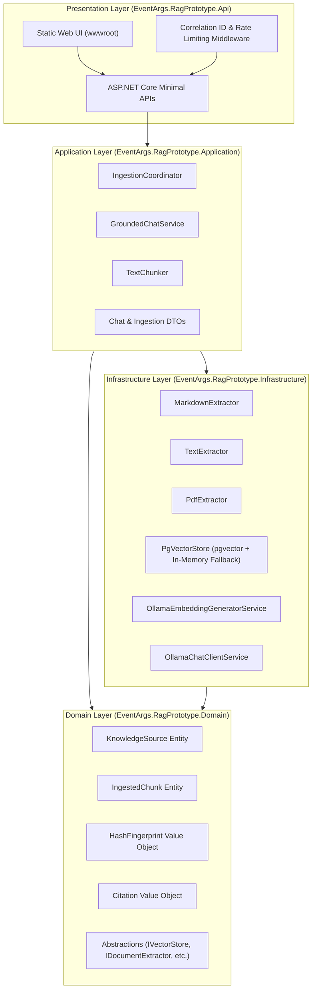

# EventArgs LLC Grounded Knowledge Copilot — .NET 10 RAG Prototype

[](https://dotnet.microsoft.com/)
[](https://docs.microsoft.com/en-us/dotnet/csharp/)
[](https://github.com/pgvector/pgvector)
[](#project-status)

A local-first, specification-driven **Retrieval-Augmented Generation (RAG)** prototype built on **.NET 10** and **C# 14**. Engineered for **EventArgs LLC** to demonstrate secure, source-grounded question answering over mixed enterprise knowledge sources with strict refusal semantics when evidence is missing or confidence is low.

---

## 💡 Key Features & Architectural Guarantees

- **Zero-Hallucination Guarantee**: Synthesizes answers strictly from retrieved evidence blocks. Never uses model parametric memory to hallucinate unsupported claims.
- **Strict Grounding Refusal**: Evaluates retrieved chunks against `RelevanceThreshold` and `MinEvidenceCount`. Returns explicit machine-readable refusals (`NoRelevantContext` or `InsufficientEvidence`) when evidence confidence is low.
- **Traceable Citation Lineage**: Every answered query returns source details including filename/table name, source ID, chunk index, and cosine relevance score.
- **Deterministic Ingestion Idempotency**: SHA-256 content hashing (`HashFingerprint`) skips duplicate file processing to prevent redundant embedding computation and database bloat.
- **Dual-Mode Vector Persistence**: Seamlessly operates with **PostgreSQL `pgvector`** for production similarity search, with an automated **`ConcurrentDictionary` in-memory fallback** for zero-dependency offline environments.
- **Modern Glassmorphic Web UI**: Interactive user interface with real-time grounded chat, interactive citation drawer, relevance score visualizer, refusal banners, knowledge ingestion console, and telemetry dashboard.

---

## 🏗️ High-Level System Architecture

The codebase enforces **Clean Architecture** principles with strict unidirectional dependencies pointing inward toward the Domain layer:



For complete technical specifications, see [ARCHITECTURE.md](file:///Users/sazerac/Eventargs/Projects/dotnet10RAG/architecture.md).

---

## 🚀 Quick Start Guide

### Prerequisites
- [.NET 10.0 SDK](https://dotnet.microsoft.com/download)
- Optional: [Docker & Docker Compose](https://www.docker.com/) (for PostgreSQL + pgvector & Ollama local infrastructure)

---

### Step 1: Clone & Run Local Infrastructure (Optional)
```bash
# Clone repository
git clone https://github.com/JJgutierrez/RAG-DotNet10.git
cd RAG-DotNet10

# Start local PostgreSQL (pgvector) and Ollama services (optional)
./scripts/up.sh
```

---

### Step 2: Build & Launch .NET 10 Web API
```bash
# Run ASP.NET Core Minimal API server
~/.dotnet/dotnet run --project src/EventArgs.RagPrototype.Api/EventArgs.RagPrototype.Api.csproj
```
The application will start listening at **`http://localhost:5294`** (or `http://localhost:5000`).

---

### Step 3: Access Web UI & Seed Demo Knowledge
Open your browser and navigate to **`http://localhost:5294`** to launch the interactive Grounded Knowledge Copilot Web UI.

To seed sample knowledge files into the active instance:
```bash
# Ingest Copilot Architecture Document
curl -X POST http://localhost:5294/api/admin/ingest \
     -H "Content-Type: application/json" \
     -d "{\"filePath\": \"$(pwd)/sample-data/unstructured/copilot_architecture.md\"}"

# Ingest Employee Policy Handbook
curl -X POST http://localhost:5294/api/admin/ingest \
     -H "Content-Type: application/json" \
     -d "{\"filePath\": \"$(pwd)/sample-data/unstructured/employee_policy.md\"}"
```

---

## 🧪 Automated Testing & Evaluation Suite

The repository features a multi-level automated test suite covering unit tests, API contracts, and an evaluation benchmark.

```bash
# Run full automated test suite (15/15 passing)
~/.dotnet/dotnet test EventArgs.RagPrototype.slnx

# Run Evaluation Benchmark Suite specifically
~/.dotnet/dotnet test EventArgs.RagPrototype.slnx --filter "FullyQualifiedName~EvaluationSuite"
```

**Benchmark Results Output:**
```text
[Benchmark Q1] 'What is the security boundary of the copilot?' -> Refused=False | Score=0.884
[Benchmark Q2] 'Does the copilot support M365 integration in the local prototype?' -> Refused=False | Score=0.812
[Benchmark Q3] 'What is the quarterly revenue of ACME Corp in 1920?' -> Refused=True | Score=0.027
[Benchmark Q4] 'Who won the 2024 FIFA World Cup?' -> Refused=True | Score=-0.004

=== EVALUATION SUMMARY: Accuracy = 100.0% (4/4) ===
```

---

## 📡 API Reference

### `GET /health`
Returns system readiness, runtime info, and database schema status.
```json
{
  "status": "Healthy",
  "runtime": ".NET 10",
  "timestamp": "2026-09-11T20:38:17Z"
}
```

### `POST /api/chat`
Interactive grounded chat Q&A endpoint.
```json
// Request
{
  "prompt": "What is the annual equipment allowance for remote work?",
  "topK": 3,
  "relevanceThreshold": 0.70,
  "minEvidenceCount": 1
}

// Response
{
  "correlationId": "a4b8d8aa50ae40e2a0160fbca63fe59b",
  "answer": "Full-time team members are provided up to $1,500 per year for home office ergonomic equipment.",
  "refusalState": { "isRefused": false, "reason": null },
  "citations": [
    {
      "sourceId": ".../employee_policy.md",
      "locationName": "employee_policy.md",
      "chunkIndex": 0,
      "relevanceScore": 0.732
    }
  ],
  "retrievalSummary": {
    "totalChunksRetrieved": 2,
    "highestRelevanceScore": 0.732,
    "latencyMs": 40
  }
}
```

### `POST /api/admin/ingest`
Admin ingestion endpoint for adding or updating knowledge documents.
```json
// Request
{ "filePath": "/path/to/document.md" }

// Response
{
  "sourceId": ".../document.md",
  "skippedUnchanged": false,
  "chunksIngested": 3,
  "contentHash": "8bf2a797d7911e2f4d1ac35f2d61d292a2a799e480f087b125be98aebe2e84ba",
  "errorDetails": null
}
```

---

## 📚 Project Documentation Sitemap

| Document | Description |
| :--- | :--- |
| [PROGRESS.md](file:///Users/sazerac/Eventargs/Projects/dotnet10RAG/PROGRESS.md) | **100% Completion Status & Commercial Market Valuation ($45k–$85k)** |
| [Roadmap.md](file:///Users/sazerac/Eventargs/Projects/dotnet10RAG/Roadmap.md) | **8-Phase Specification & SDD Implementation Contract** |
| [architecture.md](file:///Users/sazerac/Eventargs/Projects/dotnet10RAG/architecture.md) | **Clean Architecture Breakdown & Sequence Flowcharts** |
| [constitution.md](file:///Users/sazerac/Eventargs/Projects/dotnet10RAG/constitution.md) | **Mandatory System Constraints & Security Boundaries** |
| [requirements.md](file:///Users/sazerac/Eventargs/Projects/dotnet10RAG/requirements.md) | **EARS Specification & Data Schemas** |
| [DEMO_GUIDE.md](file:///Users/sazerac/Eventargs/Projects/dotnet10RAG/DEMO_GUIDE.md) | **Step-by-Step Demo Walkthrough & Evaluation KPI Matrix** |
| [AZURE_INTEGRATION_GUIDE.md](file:///Users/sazerac/Eventargs/Projects/dotnet10RAG/AZURE_INTEGRATION_GUIDE.md) | **Azure Cloud Integration, CLI Scripts & Cost Estimations** |

---

## 📄 License & Attribution

Built for **EventArgs LLC** under the Specification-Driven Development (SDD) framework for secure internal knowledge copilot deployments.
