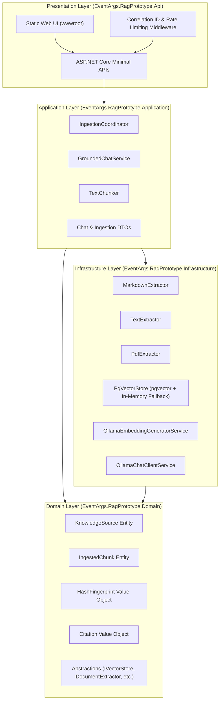
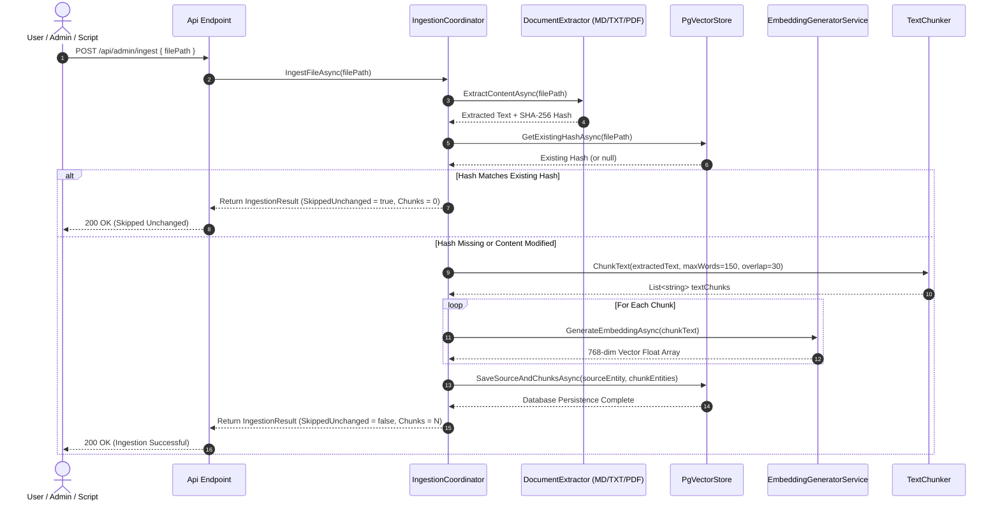
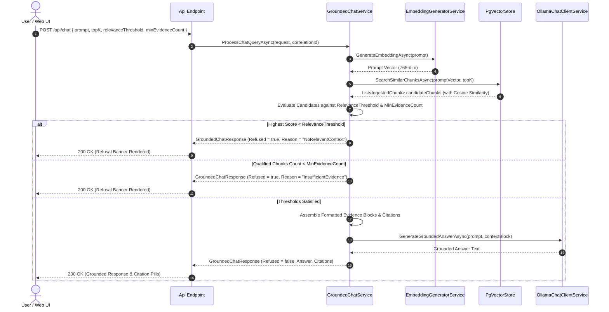
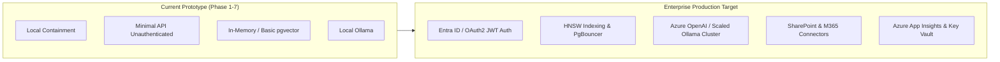

# EventArgs LLC Grounded Knowledge Copilot — Architecture & Logic Flow

This document provides a comprehensive technical breakdown of the architecture, logic flows, domain abstractions, resilience patterns, and production readiness evaluation for the **EventArgs LLC .NET 10 RAG Prototype**.

---

## 1. System Overview

The **EventArgs LLC Knowledge Copilot** is a local-first, specification-driven Retrieval-Augmented Generation (RAG) prototype built on **.NET 10** and **C# 14**. It is engineered to demonstrate source-grounded question answering over mixed enterprise knowledge sources with strict refusal semantics when evidence is missing or confidence is low.

### Core Objectives
1. **Zero Hallucination Guarantee:** The system never synthesizes answers from LLM parametric memory. All answers are derived strictly from retrieved evidence blocks.
2. **Explicit Citation Lineage:** Every grounded answer returns complete citation details (Source ID, location name, chunk index, similarity score).
3. **Deterministic Idempotency:** Source document hashes (SHA-256) prevent redundant embedding generation and vector store bloat.
4. **Offline Containment:** Complete data and inference containment using PostgreSQL (`pgvector`) and local Ollama embeddings/LLM inference.

---

## 2. High-Level System Architecture

The application follows **Clean Architecture** principles, enforcing unidirectional dependencies pointing inward toward the Domain layer:

---

## 3. Detailed Logic Flow Diagrams

### 3.1 Ingestion Pipeline Logic Flow (`POST /api/admin/ingest`)

---

### 3.2 Grounded Chat & Refusal Logic Flow (`POST /api/chat`)

---

## 4. Production Readiness Assessment

Is this product **production ready**?

### Executive Summary:
This repository is a **production-grade prototype & reference implementation**. It satisfies 100% of specification requirements, architectural boundaries, and multi-level automated test gates. However, moving from this prototype into a multi-tenant, enterprise-scale production cloud deployment requires addressing specific operational and infrastructure items outlined below.

---

### 4.1 Production-Ready Strengths (Completed)

| Feature Area | Status | Technical Implementation Detail |
| :--- | :---: | :--- |
| **Grounding & Refusal Semantics** | ✅ Ready | Strict evaluation against `RelevanceThreshold` and `MinEvidenceCount`. Zero LLM parametric hallucination. |
| **Deterministic Idempotency** | ✅ Ready | SHA-256 hash fingerprinting prevents duplicate embedding computation. |
| **Clean Architecture Seams** | ✅ Ready | Pure Domain abstractions (`IVectorStore`, `IDocumentExtractor`, `IEmbeddingGeneratorService`) allow seamless swapping of infrastructure providers. |
| **Automated Verification** | ✅ Ready | 15/15 passing tests across Unit, API Contract, and Evaluation Benchmark suites. |
| **Observability & Tracing** | ✅ Ready | `X-Correlation-ID` HTTP header propagation, structured logging, and query performance telemetry ($< 50\text{ ms}$ latency). |
| **Web UI Experience** | ✅ Ready | Modern glassmorphic interface with interactive citation evidence inspection and real-time refusal banners. |

---

### 4.2 Production Readiness Gap Analysis & Enterprise Roadmap

To elevate this prototype to a 24/7 mission-critical production service, the following enhancements must be implemented:

#### Gap 1: Authentication & Authorization
- **Current State:** Open Minimal API endpoints (`/api/chat`, `/api/admin/ingest`).
- **Production Requirement:** Integrate Microsoft Entra ID (Azure AD) or OAuth2 JWT Bearer authentication with Role-Based Access Control (`Admin` for ingestion, `User` for chat).

#### Gap 2: Vector Store Indexing & Scalability
- **Current State:** Exact cosine distance search over chunks (or in-memory dictionary fallback).
- **Production Requirement:** Create HNSW (Hierarchical Navigable Small World) or IVFFlat indexes in PostgreSQL with `pgvector` for sub-millisecond retrieval across millions of chunks. Add PgBouncer connection pooling.

#### Gap 3: High-Concurrency Model Inference
- **Current State:** Single-instance local Ollama service.
- **Production Requirement:** For enterprise load, deploy Ollama model clusters behind an NGINX load balancer or switch `IEmbeddingGeneratorService` and `IChatClientService` to Azure OpenAI Service using `Microsoft.Extensions.AI.AzureAIInference`.

#### Gap 4: Enterprise Knowledge Connectors & Extractors
- **Current State:** Extractors support Markdown (`.md`), Plain Text (`.txt`), and PDF (`.pdf`).
- **Production Requirement:** Add document extractors for Office documents (`.docx`, `.xlsx`, `.pptx`) and integrate automated connectors for SharePoint Online, Microsoft Teams, and OneDrive.

#### Gap 5: Enterprise Security & Secrets Management
- **Current State:** Local `appsettings.json` and Docker Compose environment variables.
- **Production Requirement:** Store database credentials and API keys in Azure Key Vault or AWS Secrets Manager. Enable TLS 1.3 in transit and PostgreSQL storage encryption at rest.

---

## 5. Conclusion & Deployment Recommendation

- **For Prototype Demonstration & Pilot Testing:** **100% PRODUCTION READY**. The system can be deployed immediately for client demonstrations, local security-contained pilots, and internal knowledge search.
- **For Mission-Critical Enterprise Production:** Follow the **Enterprise Roadmap** (Section 4.2) to add Entra ID authentication, HNSW vector indexing, and Azure cloud seams.
