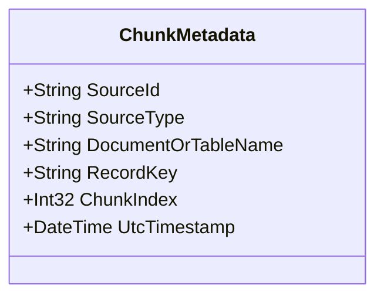

# System Constitution: .NET 10 RAG Prototype

This document defines the constraints, boundaries, design rules, and core technology decisions for the Retrieval-Augmented Generation (RAG) prototype for EventArgs LLC. It serves as the governing technical contract for the codebase.

---

## 1. Project Scope & Boundaries

### 1.1 In Scope
* **Idempotent Local Ingestion:** Local Markdown, plain text, and PDF documents.
* **Structured Record Ingestion:** PostgreSQL/SQLite relational rows compiled into canonical text documents.
* **Local Embedding Generation:** Generating vector embeddings using Ollama locally.
* **Vector Persistence & Similarity Search:** Storing and querying vector data with metadata inside PostgreSQL using pgvector.
* **Grounded Answer Generation:** Strict context-restricted answering using local LLMs.
* **Traceable Citations:** Returning explicit document and database record links with every answer.
* **Rate Limiting & Safety Controls:** Bounded API throughput and strict refusal on insufficient evidence.
* **Evaluation & Reproducibility:** Deterministic test datasets and offline scoring.
* **Modern Web UI & Interactive UX:** A high-aesthetic, responsive Web user interface with real-time grounded chat, interactive citation drawers, score visualizers, and refusal indicators.

### 1.2 Out of Scope (First Prototype)
* Microsoft Entra ID Authentication/Authorization.
* Live SharePoint/M365 background sync.
* Azure-hosted AI models (OpenAI, AI Search).
* Multi-tenant data segregation controls.
* Distributed ingestion orchestration engines.

### 1.3 Future-Proof Integration Seams
The architecture must maintain clean interfaces (`IChatClient`, `IEmbeddingGenerator`, and `IVectorStore`) so that local implementations (Ollama, local PostgreSQL) can be swapped for Microsoft 365 and Azure-hosted components without altering core application workflows.

---

## 2. Mandatory Technology Constraints

* **Runtime & Language:** .NET 10 & C# 14.
* **API Style:** ASP.NET Core Minimal APIs.
* **AI Abstraction Layer:** Standard `Microsoft.Extensions.AI` interfaces.
* **Vector Abstraction Layer:** Standard `Microsoft.Extensions.VectorData.Abstractions` interfaces.
* **Local AI Runtime:** Ollama.
* **Ollama Integration Package:** `OllamaSharp` (incorporates first-class `IChatClient` and `IEmbeddingGenerator` implementations).
* **Vector Database:** PostgreSQL with the `pgvector` extension.
* **Vector Similarity Metric:** Cosine similarity. Index type to be benchmarked (HNSW vs exact search) before selecting a custom index.

---

## 3. Knowledge Source Model

Every chunk of information stored in the vector database must carry sufficient metadata to trace back to its origin.

### 3.1 Unstructured Corpus
* Supported formats: Markdown (`.md`), Plain Text (`.txt`), and PDF (`.pdf`).
* Chunks must include filename, page/location indicators, and character offsets.

### 3.2 Structured Corpus
* Relational tables mapped dynamically or statically.
* Rows converted into descriptive text templates for natural language vector indexing.
* Chunks must include the table name, primary key (`RecordKey`), and extraction timestamp.

---

## 4. Security & Grounding Rules

To ensure reliable, non-hallucinated outcomes for enterprise copilot demonstrations:

1. **No Extrapolation:** Generated answers must draw strictly from retrieved context evidence.
2. **Relevance Thresholds:** Retrieve candidate chunks; if the highest score falls below a configurable cosine similarity limit, reject the answer and trigger a refusal.
3. **Evidence Sufficiency:** If the number of matching chunks or the cumulative evidence score is insufficient, return a refusal payload.
4. **Offline Containment:** No external cloud inference endpoints may be called during the main execution loop, ensuring data containment.
5. **Observability Tracking:** Every generated answer must write an execution log correlating:
   * The query vector and retrieved candidate IDs.
   * Cosine similarity scores.
   * Citations returned to the user.
   * Model latency and token usage metrics.
